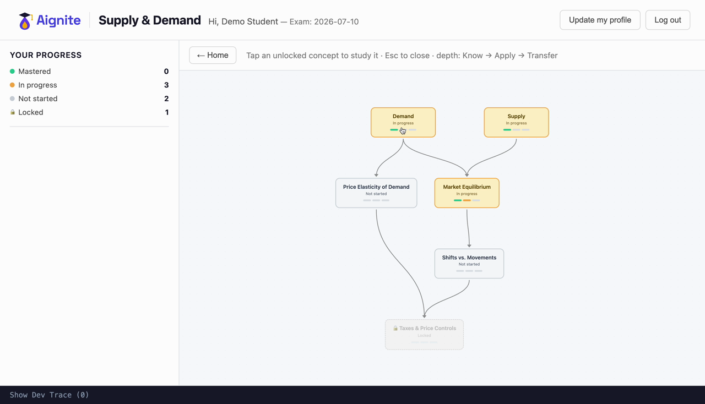
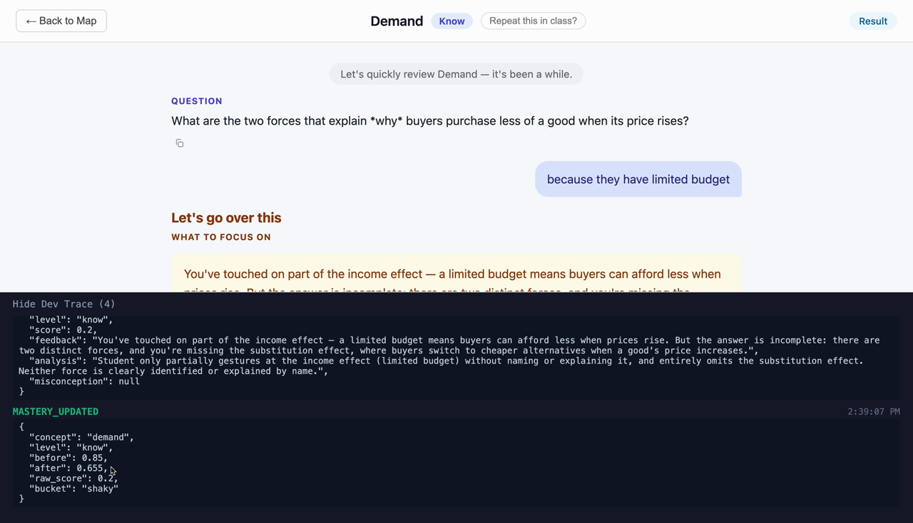
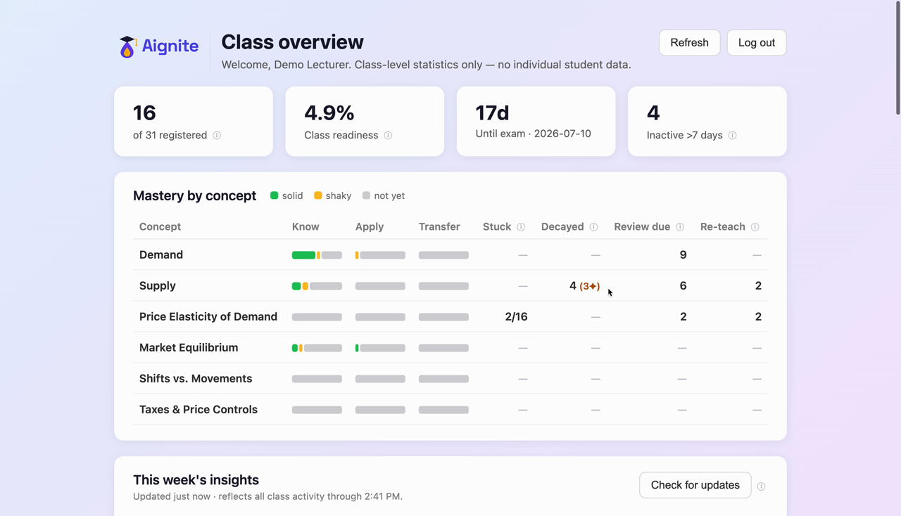
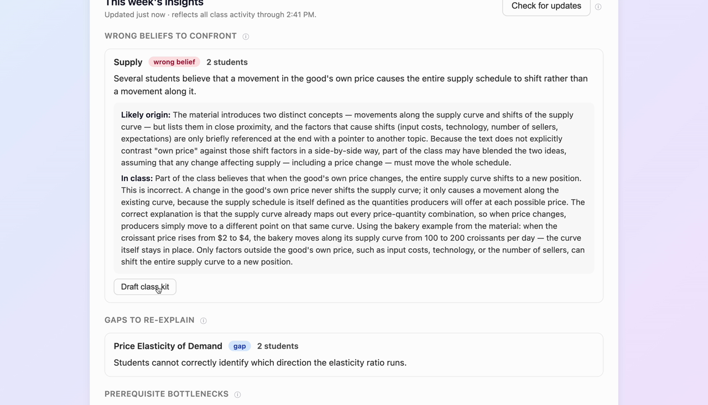

# Aignite

**Adaptive AI tutoring for students, and class analytics and AI insights for lecturers.**

<p align="center">
  
  <br><em>~60-second walkthrough: concept map → adaptive tutoring → live decision trace → lecturer insight suite</em>
</p>

> **Status:** a working full-stack system I designed and built end to end (React + TypeScript front-end, Python + FastAPI + LangGraph back-end), in active development toward a pilot with a higher-education institution. This repository is a curated **showcase**; the deployable source stays private (see [What's in this repo](#whats-in-this-repo)). For a live walkthrough or a look at the full codebase, [reach out](#contact).

---

## What it is

A web app where a student learns a subject with an AI tutor (the demo subject is **Supply & Demand**: 6 concepts, each taught at 3 depth levels). The tutor teaches concepts in prerequisite order and checks understanding with questions it generates on the spot. It adapts what to teach next from how the student answers, and it brings earlier material back for spaced review. The home screen is a **concept map** that shows the system's state directly: mastery per concept, prerequisite edges, and nodes that unlock as the student progresses.

Lecturers get a separate surface: a class metrics board and an **AI insight suite** that clusters the class's misconceptions, proposes a next lecture, and drafts classroom interventions. It runs entirely on aggregates; individual student data has no path across the boundary.

<p align="center"></p>

## What you're seeing in the walkthrough

One full loop of the student experience, then the lecturer view:

1. **Concept map** (home). Colour is mastery: grey not-started, amber shaky, green solid. A concept unlocks only once its prerequisites are solid.
2. **Plan a session.** The planner proposes three ordered phases (review what's fading, deepen what's started, learn something new). The student can also ignore the plan and pick any unlocked concept from the map.
3. **A tutoring turn.** A warm-up question, a short adapted explanation, then a scored question. A second agent grades the free-text answer; a strong answer lifts mastery and the map updates to match.
4. **Lecturer view.** A class metrics board, then AI-clustered misconceptions with a suggested next lecture.

The dark panel in the clip is a **dev-trace panel**, an inspector that streams the agents' decisions live (concept selected, question asked, answer evaluated, mastery updated). A student never sees it; it's surfaced in the demo so you can watch the system decide, not just read its final reply.

<p align="center"></p>

## Engineering highlights

- **Two cooperating agents, explicitly orchestrated.** A **Tutor** agent runs the Prime → Teach → Assess loop, then hands the answer to a separate **Evaluator** agent that scores it. They're two distinct LLMs wired as nodes in a small [LangGraph](https://github.com/langchain-ai/langgraph) state machine, with explicit conditional routing. A bare `while` loop would have hidden the structure the design is about; a multi-subgraph framework would have been over-engineering for two agents.
- **Decisions run on coarse buckets, not raw floats.** Mastery is a float, updated with an exponential moving average, but every *decision* (unlock a concept, reteach or move on, prerequisite met, mastered?) reads one of three buckets: `not-yet`, `shaky`, `solid`. An LLM-graded score is noisy; branching on `0.71` vs `0.69` would make the system jittery for no real signal. Three buckets keep every decision stable and easy to narrate.
- **Instrumented so the adaptive logic is inspectable.** Every decision emits a structured event (concept selected, answer evaluated, mastery updated), streamed to the client over **Server-Sent Events** as the agent works, so the tutoring API never collapses a multi-step agent into one request/response call. That instrumentation drives the dev-trace panel I used to verify and demo the system; in normal use it's hidden, not student-facing.
- **Privacy by construction.** The lecturer's only data path is one interface whose method signatures return counts, means, and distributions, and never a student identity. The two features that need text return a dataclass with no student field, so an identity can't cross the boundary even by accident. [See how.](ARCHITECTURE.md#5-privacy-by-construction)
- **LLM safety as a first-class threat model.** The insight suite reads text derived from student answers, a prompt-injection surface, so the pipeline lets the model write prose while code does the counting, validates plans against the prerequisite graph, and holds a deterministic output gate. Intervention scripts wait for a human to approve them. Behaviour is pinned by golden eval suites (clustering counts, injection resistance via canary tokens, grounded output).
- **Scope discipline as a design goal.** RAG was dropped because the source text fits in the prompt. Spaced repetition is a `pass → ×2 / fail → 1-day` rule, not FSRS. Per-strategy session behaviour is a wired-but-inert seam. Each of these is a deliberate choice, [documented](ARCHITECTURE.md#10-what-was-deliberately-not-built) with its reasoning.

## Architecture at a glance

```
                 ┌──────────────────────────────────────────┐
   Student  ──▶  │  React + TypeScript UI (map, tutoring)    │
                 └───────────────┬──────────────────────────┘
                                 │  SSE: live agent steps + decision events
                 ┌───────────────▼──────────────────────────┐
                 │  FastAPI  ·  JWT auth (httpOnly cookie)    │
                 ├───────────────────────────────────────────┤
                 │  LangGraph orchestration                  │
                 │    Tutor node ──handoff──▶ Evaluator node │
                 ├───────────────────────────────────────────┤
                 │  Planner · Scheduler · Mastery updater    │
                 │  (decisions on coarse buckets)            │
                 ├───────────────────────────────────────────┤
                 │  Repository interfaces (storage-agnostic) │
                 │    student · mastery · attempts           │
                 │    LecturerAnalytics (aggregates only)    │
                 └───────────────┬──────────────────────────┘
                                 │
                 ┌───────────────▼──────────────────────────┐
                 │  SQLite (SQLAlchemy) + course.json        │
                 │  durable LangGraph checkpointer           │
                 └───────────────────────────────────────────┘
```

Full design reasoning lives in **[ARCHITECTURE.md](ARCHITECTURE.md)**.

## A look at the code

The full source is private, so here are a few excerpts that show the house style.

**Front-end: consuming the agent's decision stream over SSE.** `EventSource` only does GET, so the client reads `text/event-stream` itself, buffering and splitting on frame boundaries so the UI updates on every agent step while the final state resolves at the end of the turn.

```typescript
const reader = res.body.getReader();
const decoder = new TextDecoder();
let buffer = "";

for (;;) {
  const { done, value } = await reader.read();
  if (done) break;
  buffer += decoder.decode(value, { stream: true });
  let sep;
  while ((sep = buffer.indexOf("\n\n")) !== -1) {
    const frame = buffer.slice(0, sep);
    buffer = buffer.slice(sep + 2);
    handleFrame(frame); // event: "step" → onStep(...) ; event: "state" → finalState
  }
}
```

**Front-end: state encoded for accessibility, not just colour.** Each concept shows its per-level mastery as a small glyph whose *shape* carries the meaning, so it stays legible for colourblind readers and reads faster at a glance.

```typescript
// mastered = check, in progress = half-filled, not started = outline
function LevelStateGlyph({ bucket }: { bucket: LevelBucket }) {
  const color = BUCKET_BAR[bucket];
  if (bucket === "solid")
    return <span style={{ ...base, background: color }}>✓</span>;
  if (bucket === "shaky")
    return <span style={{ ...base, border: `1.5px solid ${color}`,
      background: `linear-gradient(90deg, ${color} 50%, transparent 50%)` }} />;
  return <span style={{ ...base, border: `1.5px solid ${color}` }} />;
}
```

**Back-end: privacy enforced by a type, not a rule.** The two insight features that genuinely need text return this dataclass. It has no student field, so an identity can't cross the boundary even by accident.

```python
@dataclass(frozen=True)
class ActiveIssue:
    """One student's current diagnosis at one concept, identity-stripped by
    construction: the dataclass has no student field, so a student id cannot
    cross this boundary even by accident."""
    concept_id: str
    level: str
    analysis: str | None
    misconception: str | None
```

More (the LangGraph wiring, the bucket logic, the aggregate-only repository, the SSE relay) is in [ARCHITECTURE.md](ARCHITECTURE.md).

## The lecturer surface

A class metrics board (per-concept buckets, who's stuck, what's decayed, what's overdue) plus an insight suite that clusters the class's misconceptions and proposes what to teach next, all from aggregates.

<p align="center">
  
  
</p>

## Tech stack

| | |
|---|---|
| **Front-end** | React, TypeScript, Vite, [@xyflow/react](https://reactflow.dev/) for the concept map |
| **Back-end** | Python, FastAPI, LangGraph, Anthropic Claude, SQLAlchemy / SQLite, argon2 + JWT, Server-Sent Events |
| **Quality** | the deterministic logic (mastery, scheduler, planner, repositories, graph routing) is covered by a `pytest` suite that runs offline against a stubbed LLM (~2,400 lines across 19 files); live LLM behaviour is pinned by golden eval suites |

## What's in this repo

This is a **showcase**, not the deployable source. The full Aignite codebase is private while the project heads into a pilot. Kept private on purpose: the prompts (where most of the product-specific work in an LLM system lives), the eval suites, and the full implementation. Here you'll find:

- this overview,
- **[ARCHITECTURE.md](ARCHITECTURE.md)**: the design decisions and trade-offs, with illustrative, non-deployable code excerpts,
- the demo and screenshots in [`media/`](media/).

Happy to walk through the live system or the private codebase on request.

## Contact

**Chen Swissa** · chennys25@gmail.com · [LinkedIn](https://www.linkedin.com/in/chen-swissa-514019b0/)

---

<sub>Aignite began as a graduate gen-AI course project and is being developed toward a real-world pilot. © 2026, all rights reserved (see [LICENSE](LICENSE)).</sub>
